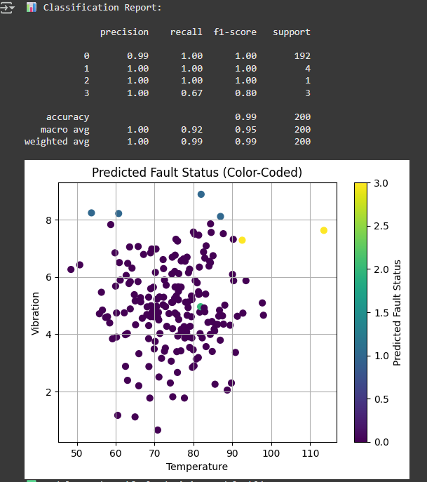

#  Smart Fault Decision Agent

### *“When to Repair, Replace, Alert or Ignore?”*

> A prototype built for **Xempla’s Decision Intelligence R&D Internship** to showcase how intelligent agents can assist in real-time system fault classification and decision-making for industrial assets like HVACs, turbines, or smart devices.

---

## 📌 Problem Statement

In smart maintenance systems, timely decisions can save millions.  
This project answers a key question:  
👉 **“Given sensor data, should we REPAIR, REPLACE, ALERT, or take NO_ACTION?”**

The goal: Create a machine learning agent that mimics decision intelligence by interpreting key sensor readings and recommending the right maintenance strategy.

---

## 🧠 Model Architecture

| Feature         | Description                    |
|-----------------|--------------------------------|
| `temperature`   | Sensor temp reading (°C)       |
| `vibration`     | Vibration magnitude (mm/s)     |
| `pressure`      | Internal system pressure (psi) |
| `runtime_hours` | Usage hours since last check   |

**Output Labels:**

| Label | Meaning     |
|-------|-------------|
| `0`   | NO_ACTION   |
| `1`   | REPAIR      |
| `2`   | REPLACE     |
| `3`   | ALERT       |

- 🧩 **Model:** Random Forest Classifier  
- 📈 **Accuracy:** ~99% on synthetic test data  
- 🧰 **Tech Stack:** `scikit-learn`, `pandas`, `joblib`, `matplotlib`

---

## 💡 How It Works

1. Loads the trained ML model: `fault_decision_model.pkl`  
2. Accepts real-time or test sensor inputs  
3. Predicts the best next action based on historical patterns and decision logic

---

## ✅ Sample Prediction

```python
Input:
{
  'temperature': 95,
  'vibration': 8.5,
  'pressure': 25,
  'runtime_hours': 600
}

Output:
Predicted Action → REPAIR
```
## 📸 Sample Output


